# Claude Code Hooks Library (cchooks)

## Change Log (最新变更日志)

**2025-09-18 16:35:48** - AI上下文初始化完成
- 创建了完整的项目AI上下文索引 (`.claude/index.json`)
- 更新了根级CLAUDE.md文档，添加模块结构图和导航
- 扫描覆盖率: 90% (38/42文件)
- 识别了9种钩子类型和完整的测试套件

---

## Project Vision

cchooks 是一个为 Claude Code 开发钩子的 Python 库。钩子是用户定义的 shell 命令，在 Claude Code 生命周期的各个关键点执行。该库为所有9种钩子类型提供类型安全的接口和实用工具。

## Architecture Overview

该库围绕类型安全的上下文系统构建，每种钩子类型都有专门的上下文和输出类。核心架构包括：

- **类型系统**: 完整的 Claude Code 钩子类型定义
- **基础类**: 所有钩子上下文的抽象基类
- **上下文实现**: 9种钩子类型的具体实现
- **工厂模式**: 自动钩子类型检测和上下文创建
- **输出处理**: 统一的JSON输出和简单模式支持

## Module Structure Diagram



## Module Index

| 模块 | 路径 | 责任 | 关键文件 |
|------|------|------|----------|
| **Core** | `src/cchooks/` | 主库模块，提供9种钩子上下文 | `__init__.py`, `types.py` |
| **Contexts** | `src/cchooks/contexts/` | 钩子上下文实现 | `base.py`, `pre_tool_use.py` |
| **Tests** | `tests/` | 完整测试套件，包括单元和集成测试 | `conftest.py`, `contexts/` |
| **Documentation** | `docs/` | 用户和开发者文档 | `what-is-cc-hook.md` |

## Running and Development

### 环境设置
```bash
# 安装依赖
make setup
# 或直接使用 uv
uv sync
```

### 测试执行
```bash
# 完整测试 (包含覆盖率)
make test

# 快速测试 (无覆盖率)
make test-quick

# 特定测试文件
uv run pytest tests/contexts/test_pre_tool_use.py -v
```

### 代码质量检查
```bash
# 全面检查
make check

# 单独检查
make lint          # ruff 代码检查
make type-check    # pyright 类型检查
make format        # ruff 代码格式化
```

### 构建和分发
```bash
make build         # 构建包
make clean         # 清理构建产物
make release-check # 发布前检查
```

## Testing Strategy

### 测试架构
- **单元测试**: 每个钩子上下文的独立测试
- **集成测试**: 端到端工作流测试
- **固定装置**: 现实场景的测试数据
- **覆盖率**: pytest-cov 提供详细覆盖报告

### 钩子类型测试覆盖
✅ PreToolUse - 工具执行前的审批/阻止决策
✅ PostToolUse - 工具执行后的反馈和处理
✅ Notification - 通知处理，无决策控制
✅ UserPromptSubmit - 用户提示提交后处理
✅ Stop - Claude停止行为控制
✅ SubagentStop - 子代理停止控制
✅ PreCompact - 转录压缩前处理
✅ SessionStart - Claude Code启动或恢复会话
✅ SessionEnd - Claude Code会话结束

## Coding Standards

### Python 约定
- **类型提示**: 所有函数签名和公共属性必须有类型提示
- **导入**: 按标准库、第三方、本地分组，用空行分隔
- **命名**:
  - 类: PascalCase (`PreToolUseContext`)
  - 函数/方法: snake_case (`validate_fields`)
  - 常量: UPPER_SNAKE_CASE (`HOOK_TYPE_MAP`)

### 错误处理
- 使用 `cchooks.exceptions` 中的自定义异常
- 在上下文构造函数中验证输入数据
- 提供包含字段名称的清晰错误消息

### 钩子开发模式
- 每种钩子都有专用的Context和Output类
- 继承自 BaseHookContext/BaseHookOutput
- 使用工厂函数 `create_context()` 实例化
- 遵循Claude Code集成的JSON输入/输出模式

## AI Usage Guidelines

### 开发最佳实践
- 生成git提交消息时，遵循 "feat:", "fix:", "docs:", "refactor:" 等最佳实践
- 在整个代码库中使用类型提示
- 为所有新功能编写测试
- 提交前运行 `make check`
- 遵循现有命名约定和代码风格

### 使用模式
```python
from cchooks import create_context

# 自动从stdin读取
c = create_context()

# 类型特定处理
if isinstance(c, PreToolUseContext):
    if c.tool_name == "Write" and "password" in c.tool_input.get("file_path", ""):
        c.output.deny("拒绝写入密码文件")
    else:
        c.output.allow("安全操作")
```

### 输入/输出模式
- **简单模式**: 退出码 (0=成功, 1=非阻塞错误, 2=阻塞错误)
- **高级模式**: 包含 `continue`, `decision`, `reason` 字段的JSON

## CLI开发指南

### 命令结构约定
- **命名**: 遵循 `cchooks-*` 模式 (例如: `cchooks-init`, `cchooks-validate`)
- **标志**: 支持短格式 (`-h`) 和长格式 (`--help`)
- **输入**: 支持文件输入和stdin输入
- **配置**: 集成 `.claude/settings.json` 配置文件

### CLI输出格式
```python
# JSON格式 (程序化使用)
import json
result = {"status": "success", "data": {...}, "warnings": [...]}
print(json.dumps(result))

# 表格/文本格式 (人类可读)
print(f"✅ 成功创建钩子: {hook_name}")
print(f"📁 位置: {hook_path}")
```

### 错误处理标准
- **退出码 0**: 成功完成
- **退出码 1**: 非阻塞警告 (操作继续)
- **退出码 2**: 阻塞错误 (操作停止)
- **错误消息**: 提供可操作的指导

### 配置集成模式
```python
# 读取 .claude/settings.json
from cchooks.config import load_claude_settings

settings = load_claude_settings()
hooks_config = settings.get("hooks", {})
```

### CLI工具开发流程
1. **TDD**: 先写CLI命令测试
2. **类型安全**: 完整的参数类型提示
3. **工厂模式**: 复用现有钩子上下文
4. **文档**: 内置帮助和示例
5. **性能**: 最小化启动开销

## Change Log (Changelog)

### 2025-09-18 16:35:48 - AI上下文初始化
- 创建完整项目结构索引
- 生成模块结构图和导航面包屑
- 完成90%文件扫描覆盖率
- 识别9种钩子类型完整实现
- 建立测试策略和代码标准文档