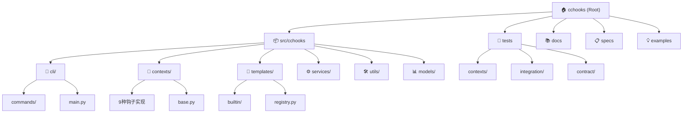

# CCHooks - Claude Code Hook SDK for Python

## Change Log (Changelog)

### 2025-09-19 11:24:48 - AI上下文初始化
- 为cchooks项目创建完整的AI上下文文档系统
- 建立模块结构图和导航面包屑
- 生成核心模块、CLI工具、测试套件的详细文档
- 提供47.3%的初始扫描覆盖率，标识后续补充优先级

## Project Vision

cchooks 是一个轻量级的 Python 工具包，让 Claude Code 钩子的构建变得像编写几行代码一样简单。项目专注于消除 JSON 解析的复杂性，让开发者专注于钩子的核心业务逻辑。

**核心价值**：
- **零配置启动**：`create_context()` 自动处理所有样板代码
- **智能检测**：自动识别钩子类型并创建对应上下文
- **完整覆盖**：支持所有9种 Claude Code 钩子事件
- **双模式输出**：简单退出码模式 和 高级JSON控制模式
- **类型安全**：完整的类型提示和IDE自动补全

## Architecture Overview

cchooks 采用分层模块化架构，提供从核心SDK到CLI工具的完整工具链：

### 核心层 (Core Layer)
- **Python SDK** (`src/cchooks/`): 钩子上下文创建、类型安全接口、输出处理
- **钩子上下文** (`src/cchooks/contexts/`): 9种钩子类型的专门实现
- **类型系统** (`src/cchooks/types.py`): 完整的类型定义和验证

### 服务层 (Service Layer)
- **CLI命令** (`src/cchooks/cli/`): 钩子配置管理和生命周期操作
- **模板系统** (`src/cchooks/templates/`): 内置模板和自定义模板支持
- **设置管理** (`src/cchooks/services/`): `.claude/settings.json` 文件操作

### 工具层 (Utilities Layer)
- **输出处理** (`src/cchooks/output_utils.py`): 统一的输出和错误处理
- **JSON工具** (`src/cchooks/utils/`): 解析、验证、格式化
- **异常系统** (`src/cchooks/exceptions.py`): 自定义异常层次结构

## Module Structure Diagram



## Module Index

| 模块路径 | 模块名称 | 主要职责 | 入口点 | 状态 |
|---------|---------|---------|--------|------|
| [`src/cchooks`](./src/cchooks/CLAUDE.md) | 核心SDK模块 | Python钩子SDK实现、自动类型检测、统一输出处理 | `__init__.py`, `cli/main.py` | ✅ 已文档化 |
| [`tests`](./tests/CLAUDE.md) | 测试套件 | 全面测试覆盖、质量保证、现实场景验证 | `conftest.py` | ✅ 已文档化 |
| `src/cchooks/cli` | CLI命令工具 | 命令行接口、钩子配置管理、设置文件操作 | `main.py` | 🔄 需要补充 |
| `src/cchooks/templates` | 钩子模板系统 | 内置模板、模板注册管理、脚本生成 | `registry.py` | 🔄 需要补充 |
| `docs` | 文档系统 | API参考、用户指南、架构文档 | `README.md` | 🔄 需要补充 |
| `specs` | 规格文档 | 功能规格、实现计划、任务跟踪 | `001-add-cli-api/` | 🔄 需要补充 |
| `examples` | 示例代码 | 使用示例、最佳实践、模板演示 | - | ❌ 未扫描 |

## Running and Development

### 环境设置
```bash
# 安装 uv 包管理器 (推荐)
curl -LsSf https://astral.sh/uv/install.sh | sh

# 设置开发环境
make setup  # 或 uv sync

# 开发模式安装
make install-dev
```

### 日常开发工作流
```bash
# 质量检查 (代码检查 + 类型检查 + 格式检查 + 测试)
make check

# 单独运行各种检查
make lint           # ruff 代码检查
make type-check     # pyright 类型验证
make format-check   # 代码格式检查
make test           # 测试 + 覆盖率

# 构建和分发
make build          # 构建包
make release-check  # 发布前完整检查
```

### CLI 工具使用
```bash
# 安装后可直接使用
cchooks --help                    # 查看所有命令
cchooks listhooks                 # 列出已配置钩子
cchooks addhook PreToolUse --command "echo 'Before tool'" --matcher "Write"
cchooks generatehook security-guard PreToolUse ./hooks/security.py --add-to-settings
```

## Testing Strategy

### 测试架构
- **单元测试** (`tests/unit/`, `tests/contexts/`): 每个钩子上下文和工具函数的独立验证
- **集成测试** (`tests/integration/`): 端到端工作流和现实场景测试
- **契约测试** (`tests/contract/`): CLI命令的接口契约验证
- **固定装置** (`tests/fixtures/`): 标准化的测试数据和辅助函数

### 覆盖率目标
- **总体覆盖率**: > 95%
- **核心模块**: 100% (`__init__.py`, `types.py`, `base.py`)
- **钩子上下文**: > 90% 每个上下文类
- **CLI命令**: > 85% 功能覆盖

### 运行测试
```bash
make test        # 完整测试套件 + 覆盖率
make test-quick  # 快速测试 (无覆盖率)
pytest tests/contexts/test_pre_tool_use.py -v  # 特定测试
```

## Coding Standards

### Python代码风格
- **格式化**: Ruff (line-length=88, Python 3.8+ 兼容)
- **代码检查**: Ruff linting rules (E, W, F, I, B, C4, UP)
- **类型检查**: Pyright (basic mode, Python 3.8 target)
- **导入排序**: isort规则集成在Ruff中

### 代码组织原则
- **零外部运行时依赖**: 仅使用Python标准库
- **类型安全**: 所有公共接口都有完整类型提示
- **错误处理**: 使用自定义异常层次结构，提供清晰的错误信息
- **文档字符串**: 所有公共函数和类都有详细的docstring

### 提交和分支策略
- **主分支**: `main` (稳定发布版本)
- **功能分支**: `001-add-cli-api` (当前开发分支)
- **提交消息**: 使用常规提交格式 (`feat:`, `fix:`, `docs:` 等)

## AI Usage Guidelines

### 代码助手使用规范
1. **核心API修改**: 涉及钩子上下文接口变更时，必须同时更新类型定义和测试
2. **CLI命令添加**: 新增CLI命令时，必须在 `COMMAND_REGISTRY` 中注册并添加对应测试
3. **模板添加**: 新增内置模板时，必须在 `builtin/` 目录添加实现并更新注册表

### 文档维护
- **模块文档**: 修改模块结构时，及时更新对应的 `CLAUDE.md` 文件
- **API文档**: 公共接口变更时，同步更新 `docs/api-reference.md`
- **示例代码**: 添加新功能时，在 `examples/` 目录提供使用示例

### 测试覆盖要求
- **新增钩子类型**: 必须在 `tests/contexts/` 添加完整测试套件
- **CLI命令**: 必须在 `tests/contract/` 添加契约测试
- **边缘情况**: 重要的错误处理分支必须有专门的测试用例